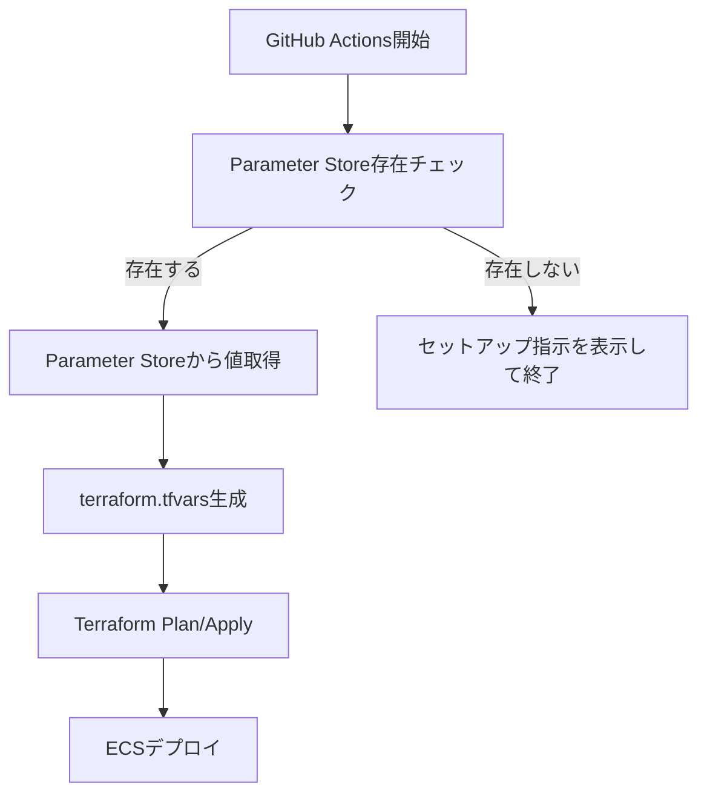

# AI Flashcards

AI技術を活用したフラッシュカード学習アプリケーション

## 🏗️ アーキテクチャ

```
Frontend (Vercel)
    ↓ HTTPS
Backend (AWS ECS Fargate) ← AWS ALB
    ↓ Private Connection
Database (AWS RDS PostgreSQL)
```

### 技術スタック
- **Frontend**: Next.js (App Router), TypeScript, Tailwind CSS
- **Backend**: Go (Gin), PostgreSQL
- **Infrastructure**: AWS (ECS, RDS, ALB, Parameter Store)
- **Authentication**: Clerk
- **Payment**: Stripe
- **AI**: Google Gemini

## 🚀 クイックスタート

### 1. 環境変数の設定

#### Option A: インタラクティブモード（推奨）
```bash
./scripts/setup-parameters.sh --interactive
```

#### Option B: ファイルから設定
```bash
# テンプレートをコピー
cp .env.example .env

# 実際の値を入力
vim .env

# Parameter Storeに設定
./scripts/setup-parameters.sh --file .env
```

#### Option C: 環境変数から設定
```bash
export CLERK_SECRET_KEY="sk_test_..."
export STRIPE_SECRET_KEY="sk_test_..."
# ... 他の環境変数

./scripts/setup-parameters.sh
```

### 2. インフラのデプロイ

```bash
cd terraform
terraform init
terraform plan
terraform apply
```

### 3. フロントエンドのデプロイ

```bash
cd frontend
bun install
bun run build

# Vercelにデプロイ
vercel --prod
```

## 🔐 環境変数管理

### Parameter Store中心の管理システム

このプロジェクトでは、AWS Parameter Storeを使用して環境変数を安全に管理しています。

#### 管理される環境変数
```
✅ CLERK_SECRET_KEY (SecureString)
✅ CLERK_WEBHOOK_SECRET (SecureString)  
✅ DATABASE_PASSWORD (SecureString)
✅ GEMINI_API_KEY (SecureString)
✅ STRIPE_SECRET_KEY (SecureString)
✅ STRIPE_PUBLISHABLE_KEY (String)
✅ STRIPE_WEBHOOK_SECRET (SecureString)
```

#### Parameter Store階層構造
```
/ai-flashcards/production/CLERK_SECRET_KEY
/ai-flashcards/production/DATABASE_PASSWORD
/ai-flashcards/production/GEMINI_API_KEY
/ai-flashcards/production/STRIPE_SECRET_KEY
/ai-flashcards/production/STRIPE_WEBHOOK_SECRET
/ai-flashcards/staging/...
/ai-flashcards/development/...
```

### セットアップスクリプト

`scripts/setup-parameters.sh`は環境変数をParameter Storeに簡単に設定できるスクリプトです。

#### 使用方法
```bash
# ヘルプ表示
./scripts/setup-parameters.sh --help

# インタラクティブモード
./scripts/setup-parameters.sh --interactive

# ファイルから読み込み
./scripts/setup-parameters.sh --file .env

# 環境別設定
./scripts/setup-parameters.sh --environment staging

# ドライラン（実際には設定しない）
./scripts/setup-parameters.sh --dry-run
```

## 📁 プロジェクト構造

```
ai-flashcards/
├── frontend/                 # Next.js フロントエンド
│   ├── app/                 # App Router
│   ├── components/          # React コンポーネント
│   └── lib/                 # ユーティリティ
├── backend/                 # Go バックエンド
│   ├── handlers/            # HTTPハンドラー
│   ├── models/              # データモデル
│   ├── middleware/          # ミドルウェア
│   └── migrations/          # データベースマイグレーション
├── terraform/               # インフラストラクチャ
│   ├── modules/             # Terraformモジュール
│   │   ├── network/         # VPC、サブネット
│   │   ├── alb/             # Application Load Balancer
│   │   ├── ecs/             # ECS Cluster、Service
│   │   ├── rds/             # PostgreSQL Database
│   │   └── ssm/             # Parameter Store
│   ├── terraform.tfvars.example
│   └── README.md
├── scripts/                 # セットアップスクリプト
│   └── setup-parameters.sh  # Parameter Store設定
├── .github/workflows/       # CI/CD
│   └── deploy.yml
├── .env.example             # 環境変数テンプレート
└── README.md               # このファイル
```

## 🔄 CI/CD パイプライン

### GitHub Actions ワークフロー

1. **Parameter Store チェック**: 必要な環境変数が設定されているか確認
2. **Docker ビルド**: バックエンドのDockerイメージをビルド・プッシュ
3. **Terraform デプロイ**: インフラストラクチャの更新
4. **ECS デプロイ**: アプリケーションの更新
5. **ヘルスチェック**: デプロイ後の動作確認

### Parameter Store自動管理



## 💰 コスト最適化

### AWS無料枠の活用
- **RDS**: db.t3.micro（750時間/月）
- **Parameter Store**: Standard（10,000パラメータまで無料）
- **ALB**: 750時間/月

### 予想月額コスト
```
RDS (db.t3.micro): $0（無料枠）
ECS Fargate: ~$15-20
ALB: $0（無料枠）
Parameter Store: $0（無料枠）
その他（データ転送等）: ~$5

合計: ~$20-25/月
```

## 🔧 開発環境セットアップ

### 前提条件
- Node.js 18+
- Go 1.23+
- AWS CLI
- Terraform 1.5+
- Docker

### ローカル開発

#### フロントエンド
```bash
cd frontend
bun install
bun run dev
```

#### バックエンド
```bash
cd backend
go mod download
go run main.go
```

#### データベース（Docker）
```bash
docker-compose up -d db
```

## 🧪 テスト

### フロントエンド
```bash
cd frontend
bun run test
bun run test:e2e
```

### バックエンド
```bash
cd backend
go test ./...
```

## 🔐 セキュリティ

### Parameter Store
- **暗号化**: KMSによる自動暗号化
- **アクセス制御**: IAMによる最小権限の原則
- **監査**: CloudTrailによる操作ログ

### アプリケーション
- **認証**: Clerk による安全な認証
- **CORS**: 適切なCORS設定
- **入力検証**: 全ての入力データの検証
- **レート制限**: API呼び出しの制限

## 📊 監視とログ

### CloudWatch
- **ECSタスクログ**: `/ecs/ai-flashcards-backend`
- **RDS監視**: Enhanced Monitoring
- **ALBログ**: アクセスログとエラーログ

### ヘルスチェック
- **ALB**: `/health`エンドポイント
- **ECS**: サービス安定性監視

## 🚨 トラブルシューティング

### よくある問題

#### 1. Parameter Storeにパラメータがない
```bash
# エラー: Required parameters not found
# 解決: セットアップスクリプトを実行
./scripts/setup-parameters.sh --interactive
```

#### 2. AWS権限エラー
```bash
# エラー: AccessDenied
# 解決: AWS CLIの設定確認
aws sts get-caller-identity
```

#### 3. Terraform状態ロック
```bash
# エラー: Error acquiring the state lock
# 解決: ロックを強制解除
terraform force-unlock LOCK_ID
```

#### 4. ECS接続エラー
```bash
# ECSタスクからRDSに接続できない場合
# セキュリティグループの設定を確認
aws ec2 describe-security-groups --group-ids sg-xxx
```

## 🔄 環境別デプロイ

### 開発環境
```bash
./scripts/setup-parameters.sh --environment development --file .env.dev
cd terraform
terraform workspace select dev || terraform workspace new dev
terraform apply -var-file="environments/dev.tfvars"
```

### ステージング環境
```bash
./scripts/setup-parameters.sh --environment staging --file .env.staging
cd terraform
terraform workspace select staging || terraform workspace new staging
terraform apply -var-file="environments/staging.tfvars"
```

### 本番環境
```bash
./scripts/setup-parameters.sh --environment production --file .env.prod
cd terraform
terraform workspace select production || terraform workspace new production
terraform apply -var-file="environments/production.tfvars"
```

## 📝 新しい環境変数の追加

新しい環境変数を追加する場合の手順：

### 1. SSMモジュールに追加
```hcl
# terraform/modules/ssm/main.tf
resource "aws_ssm_parameter" "new_api_key" {
  name  = "/${var.project}/${var.environment}/NEW_API_KEY"
  type  = "SecureString"
  value = var.new_api_key
}
```

### 2. セットアップスクリプトに追加
```bash
# scripts/setup-parameters.sh
declare -A PARAMETERS=(
    # ... 既存のパラメータ
    ["NEW_API_KEY"]="SecureString"
)
```

### 3. GitHub Actionsに追加
```yaml
# .github/workflows/deploy.yml
REQUIRED_PARAMS=(
    # ... 既存のパラメータ
    "/ai-flashcards/production/NEW_API_KEY"
)
```

### 4. テンプレートファイルに追加
```bash
# .env.example
NEW_API_KEY=your-new-api-key-here
```

## 🤝 コントリビューション

1. このリポジトリをフォーク
2. 機能ブランチを作成 (`git checkout -b feature/amazing-feature`)
3. 変更をコミット (`git commit -m 'Add amazing feature'`)
4. ブランチにプッシュ (`git push origin feature/amazing-feature`)
5. プルリクエストを作成

## 📄 ライセンス

このプロジェクトはMITライセンスの下で公開されています。

## 🆘 サポート

問題が発生した場合：

1. [Issues](https://github.com/your-username/ai-flashcards/issues)で既存の問題を確認
2. 新しいIssueを作成
3. [Discussions](https://github.com/your-username/ai-flashcards/discussions)で質問

---

**注意**: 
- `.env`ファイルには機密情報が含まれるため、Gitにコミットしないでください
- Parameter Storeの設定は本番環境では慎重に行ってください
- AWS料金の監視を定期的に行ってください
