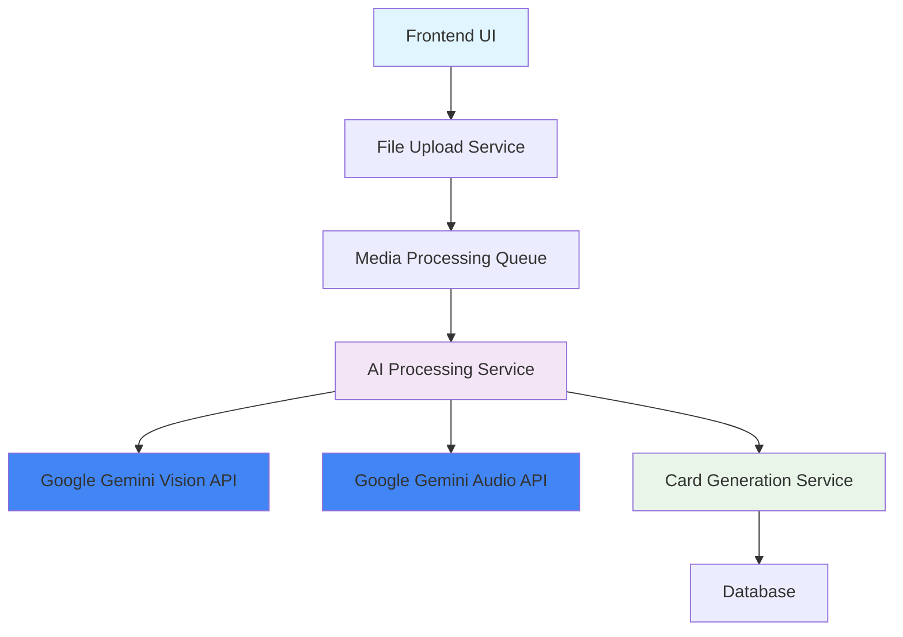
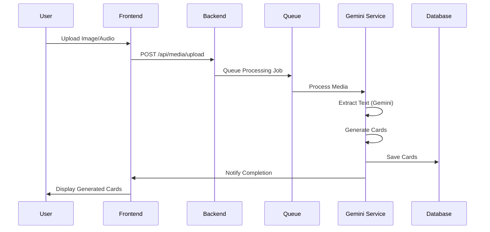

# 🤖 AI機能拡張計画 - 詳細設計書（Gemini版）

## 📋 概要

FlashAIアプリにGoogle Geminiを活用したマルチモーダルAI機能を追加し、画像・音声からのフラッシュカード生成を実現する。

## 🎯 目標機能

### 1. 画像からのカード生成
- **入力**：画像ファイル（JPEG, PNG, WebP）
- **処理**：Google Gemini Vision APIによる画像解析
- **出力**：抽出されたテキストからフラッシュカード生成

### 2. 音声からのカード生成
- **入力**：音声ファイル（MP3, WAV, M4A）または録音
- **処理**：Google Gemini Audio APIによる音声認識
- **出力**：変換されたテキストからフラッシュカード生成

## 🏗️ アーキテクチャ設計

### システム構成図


### データフロー


## 🔧 技術実装

### 1. バックエンド拡張

#### 新しいモデル
```go
// MediaFile - メディアファイル管理
type MediaFile struct {
    Model
    UserID      uint   `gorm:"not null" json:"userId"`
    FileName    string `gorm:"not null" json:"fileName"`
    FileType    string `gorm:"not null" json:"fileType"` // image, audio
    FilePath    string `gorm:"not null" json:"filePath"`
    FileSize    int64  `json:"fileSize"`
    MimeType    string `json:"mimeType"`
    ProcessedAt *time.Time `json:"processedAt"`
    Status      string `gorm:"default:'pending'" json:"status"` // pending, processing, completed, failed
}

// AIProcessingLog - AI処理ログ（Gemini用）
type AIProcessingLog struct {
    Model
    MediaFileID uint   `gorm:"not null" json:"mediaFileId"`
    ProcessType string `gorm:"not null" json:"processType"` // gemini_vision, gemini_audio
    InputData   string `json:"inputData"`
    OutputData  string `json:"outputData"`
    TokensUsed  int    `json:"tokensUsed"`
    ProcessTime int    `json:"processTime"` // milliseconds
    Status      string `json:"status"`      // success, error
    ErrorMsg    string `json:"errorMsg"`
    ModelUsed   string `json:"modelUsed"`   // gemini-pro-vision, gemini-pro
}
```

#### 新しいサービス
```go
// GeminiVisionService - Gemini画像解析サービス
type GeminiVisionService struct {
    client *genai.Client
    model  *genai.GenerativeModel
}

func (g *GeminiVisionService) AnalyzeImage(imagePath string) (*VisionResult, error) {
    // Google Gemini Vision API呼び出し
    // 画像からテキスト抽出
    // 学習コンテンツの識別
    // 日本語・多言語対応
}

// GeminiAudioService - Gemini音声認識サービス
type GeminiAudioService struct {
    client *genai.Client
    model  *genai.GenerativeModel
}

func (g *GeminiAudioService) TranscribeAudio(audioPath string) (*TranscriptionResult, error) {
    // Google Gemini Audio API呼び出し
    // 音声からテキスト変換
    // 言語検出・最適化
    // 日本語音声認識強化
}

// GeminiMediaProcessingService - Geminiメディア処理統合サービス
type GeminiMediaProcessingService struct {
    visionService *GeminiVisionService
    audioService  *GeminiAudioService
    cardService   *CardService
}
```

#### 新しいエンドポイント
```go
// POST /api/gemini/upload - ファイルアップロード
// POST /api/gemini/process - Gemini AI処理開始
// GET /api/gemini/{id}/status - 処理状況確認
// GET /api/gemini/{id}/result - 処理結果取得
```

### 2. フロントエンド拡張

#### 新しいコンポーネント
```typescript
// GeminiImageUpload - Gemini画像アップロード
interface GeminiImageUploadProps {
  onUpload: (file: File) => void;
  onGenerate: (extractedText: string) => void;
}

// GeminiAudioRecorder - Gemini音声録音
interface GeminiAudioRecorderProps {
  onRecordingComplete: (audioBlob: Blob) => void;
  onTranscribe: (transcription: string) => void;
}

// GeminiCardGenerator - Geminiベースカード生成
interface GeminiCardGeneratorProps {
  mediaType: 'image' | 'audio';
  extractedContent: string;
  onCardsGenerated: (cards: Card[]) => void;
}

// GeminiProcessingStatus - Gemini処理状況表示
interface GeminiProcessingStatusProps {
  jobId: string;
  onComplete: (result: any) => void;
}
```

#### 新しいページ
```typescript
// /cards/create/gemini-image - Gemini画像からカード生成
// /cards/create/gemini-audio - Gemini音声からカード生成
// /cards/create/gemini-multimodal - Geminiマルチモーダル生成
```

### 3. データベース拡張

#### マイグレーション
```sql
-- 000004_add_gemini_media_support.up.sql
CREATE TABLE media_files (
    id SERIAL PRIMARY KEY,
    user_id INTEGER NOT NULL REFERENCES users(id),
    file_name VARCHAR(255) NOT NULL,
    file_type VARCHAR(50) NOT NULL,
    file_path VARCHAR(500) NOT NULL,
    file_size BIGINT,
    mime_type VARCHAR(100),
    processed_at TIMESTAMP,
    status VARCHAR(50) DEFAULT 'pending',
    created_at TIMESTAMP DEFAULT NOW(),
    updated_at TIMESTAMP DEFAULT NOW(),
    deleted_at TIMESTAMP
);

CREATE TABLE ai_processing_logs (
    id SERIAL PRIMARY KEY,
    media_file_id INTEGER REFERENCES media_files(id),
    process_type VARCHAR(50) NOT NULL,
    input_data TEXT,
    output_data TEXT,
    tokens_used INTEGER,
    process_time INTEGER,
    status VARCHAR(50),
    error_msg TEXT,
    model_used VARCHAR(100), -- gemini-pro-vision, gemini-pro
    created_at TIMESTAMP DEFAULT NOW(),
    updated_at TIMESTAMP DEFAULT NOW()
);

-- カードテーブルにGemini関連フィールド追加
ALTER TABLE cards ADD COLUMN media_file_id INTEGER REFERENCES media_files(id);
ALTER TABLE cards ADD COLUMN source_type VARCHAR(50) DEFAULT 'manual'; -- manual, text, gemini_image, gemini_audio
ALTER TABLE cards ADD COLUMN ai_model_used VARCHAR(100); -- gemini-pro-vision, gemini-pro
```

## 🔄 処理フロー詳細

### Gemini画像処理フロー
1. **アップロード**：ユーザーが画像をアップロード
2. **前処理**：画像の最適化・リサイズ
3. **Gemini解析**：Gemini Vision APIで画像解析
4. **テキスト抽出**：学習コンテンツの識別・抽出
5. **カード生成**：抽出テキストからフラッシュカード作成
6. **プレビュー**：生成されたカードのプレビュー表示
7. **保存**：ユーザー確認後にカード保存

### Gemini音声処理フロー
1. **録音/アップロード**：音声の録音またはファイルアップロード
2. **前処理**：音声フォーマットの変換・最適化
3. **Gemini音声認識**：Gemini Audio APIでテキスト変換
4. **テキスト処理**：認識精度の向上・ノイズ除去
5. **カード生成**：変換テキストからフラッシュカード作成
6. **プレビュー**：生成されたカードのプレビュー表示
7. **保存**：ユーザー確認後にカード保存

## 📊 パフォーマンス考慮

### 1. ファイルサイズ制限
- 画像：最大10MB
- 音声：最大25MB
- 処理時間：最大3分（Geminiの高速処理）

### 2. 非同期処理
- Redis/Bullキューによる非同期処理
- WebSocketによるリアルタイム進捗通知
- 処理状況の永続化

### 3. キャッシュ戦略
- 処理済みファイルの結果キャッシュ
- 類似画像/音声の検出・再利用
- CDNによるメディアファイル配信

## 🔒 セキュリティ対策

### 1. ファイル検証
- MIMEタイプ検証
- ファイルサイズ制限
- ウイルススキャン

### 2. アクセス制御
- ユーザー認証必須
- ファイルアクセス権限管理
- レート制限

### 3. データ保護
- アップロードファイルの暗号化
- 処理後の一時ファイル削除
- プライバシー保護

## 💰 コスト管理（Gemini優位性）

### 1. API使用量制限
- ユーザーレベルでの月間制限
- プランに応じた制限設定
- 使用量監視・アラート

### 2. Geminiコスト優位性
- OpenAIより低コスト
- 高い処理効率
- 日本語処理の最適化

### 3. 最適化戦略
- 画像圧縮による転送量削減
- 音声品質の最適化
- バッチ処理による効率化

## 🧪 テスト戦略

### 1. ユニットテスト
- Gemini API統合テスト
- ファイル処理テスト
- エラーハンドリングテスト

### 2. 統合テスト
- エンドツーエンドフロー
- パフォーマンステスト
- セキュリティテスト

### 3. ユーザビリティテスト
- UI/UX検証
- アクセシビリティ確認
- モバイル対応テスト

## 📈 成功指標

### 1. 技術指標
- 処理成功率：95%以上
- 平均処理時間：画像20秒以内、音声40秒以内
- API応答時間：1.5秒以内

### 2. ユーザー指標
- 機能利用率：新規ユーザーの60%以上
- 満足度：4.6/5以上
- 継続利用率：75%以上

### 3. ビジネス指標
- プレミアム転換率：20%向上
- 学習効率：従来比4倍向上
- ユーザー滞在時間：60%向上

## 🌟 Geminiの優位性

### 1. 技術的優位性
- **高精度なマルチモーダル理解**
- **優れた日本語処理能力**
- **コスト効率の良さ**
- **高速な処理速度**

### 2. 開発効率
- **統一されたAPI**
- **豊富なドキュメント**
- **Go SDKの充実**
- **簡単な統合**

### 3. 将来性
- **継続的な機能向上**
- **新機能の早期アクセス**
- **Googleエコシステムとの連携**
- **スケーラビリティ**
