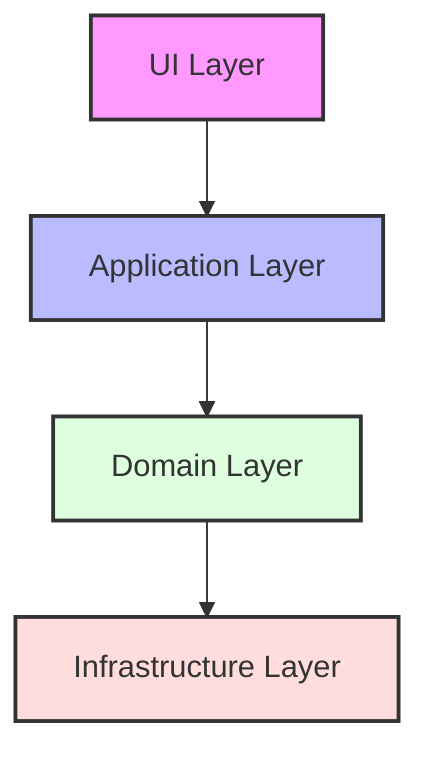
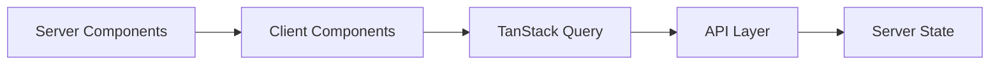
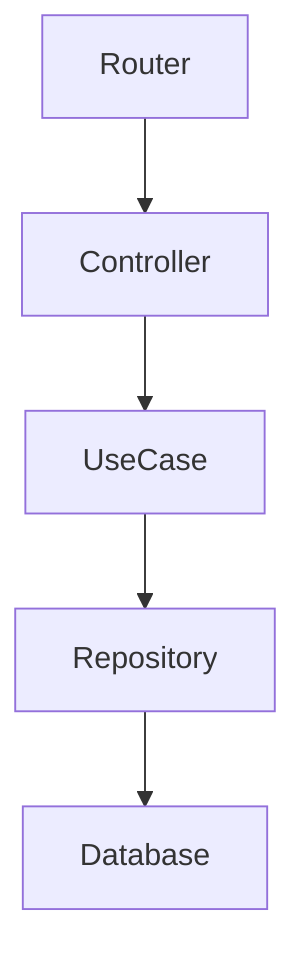
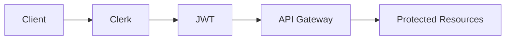
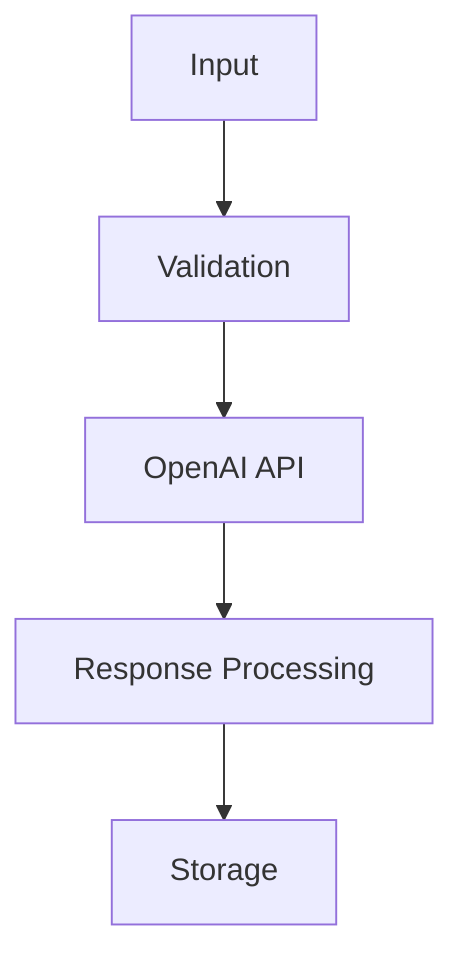
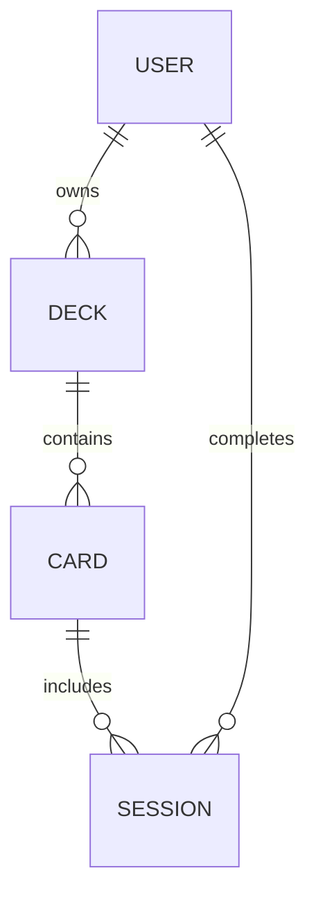
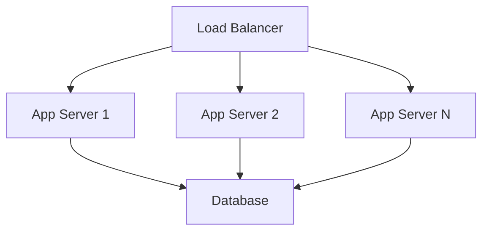

# 🏗️ AI Flashcard Generator - System Patterns

## 📐 アーキテクチャ概要

### クリーンアーキテクチャの採用

1. UI Layer（最外層）
   - Next.js Pages/Components
   - Tailwind CSSスタイリング
   - クライアントステート管理

2. Application Layer
   - ユースケース実装
   - DTO変換
   - バリデーション

3. Domain Layer（中核）
   - ビジネスロジック
   - エンティティ定義
   - ドメインサービス

4. Infrastructure Layer
   - データベースアクセス
   - 外部API連携
   - キャッシュ管理

## 🔄 データフロー

### フロントエンド

1. コンポーネント設計
   - Atomic Designの採用
   - Container/Presentational分離
   - 責務の明確な分割

2. 状態管理
   - TanStack Query中心
   - 必要最小限のクライアントステート
   - Server Stateの活用

### バックエンド

1. レイヤードアーキテクチャ
   - 依存関係の一方向性
   - インターフェース駆動
   - DIコンテナ活用

2. データアクセス
   - Repository Pattern
   - Unit of Work
   - CQRS原則

## 🔌 統合パターン

### 1. API設計
- RESTful原則の遵守
- OpenAPI（Swagger）定義
- バージョニング戦略

### 2. 認証/認可

1. Clerk認証フロー
   - JWTトークン管理
   - セッションハンドリング
   - 権限制御

2. セキュリティ考慮
   - CORS設定
   - CSRFプロテクション
   - レート制限

### 3. AI統合

1. プロンプト管理
   - バージョン管理
   - コンテキスト最適化
   - 品質制御

2. レスポンス処理
   - バリデーション
   - 正規化
   - エラーハンドリング

## 📦 データモデル

### エンティティ関係

1. スキーマ設計
   - 正規化レベルの適切な選択
   - インデックス最適化
   - 外部キー制約

2. マイグレーション戦略
   - バージョン管理
   - ロールバック対応
   - データ整合性保証

## 🔒 セキュリティパターン

### 1. 認証層
- Clerkインテグレーション
- JWTバリデーション
- セッション管理

### 2. データ保護
- 暗号化（転送時/保存時）
- アクセス制御
- 監査ログ

### 3. インフラストラクチャ
- HTTPS強制
- ファイアウォール設定
- バックアップ戦略

## 🚀 スケーラビリティパターン

### 1. 水平スケーリング

1. ステートレス設計
   - セッション外部化
   - キャッシュ戦略
   - 分散処理

2. パフォーマンス最適化
   - クエリ最適化
   - インデックス設計
   - キャッシュ層

## 📊 モニタリングパターン

### 1. アプリケーション監視
- パフォーマンスメトリクス
- エラートラッキング
- ユーザー行動分析

### 2. インフラ監視
- リソース使用率
- 可用性モニタリング
- セキュリティ監視

### 3. ビジネスメトリクス
- KPI追跡
- ユーザー満足度
- 機能利用率

## 🔄 CI/CD パターン

### 1. 継続的インテグレーション
- 自動テスト実行
- コード品質チェック
- セキュリティスキャン

### 2. 継続的デプロイ
- 環境分離
- ブルー/グリーンデプロイ
- ロールバック戦略

## 📝 ロギングパターン

### 1. アプリケーションログ
- 構造化ロギング
- レベル分け
- コンテキスト追跡

### 2. 監査ログ
- ユーザーアクション
- システム変更
- セキュリティイベント
